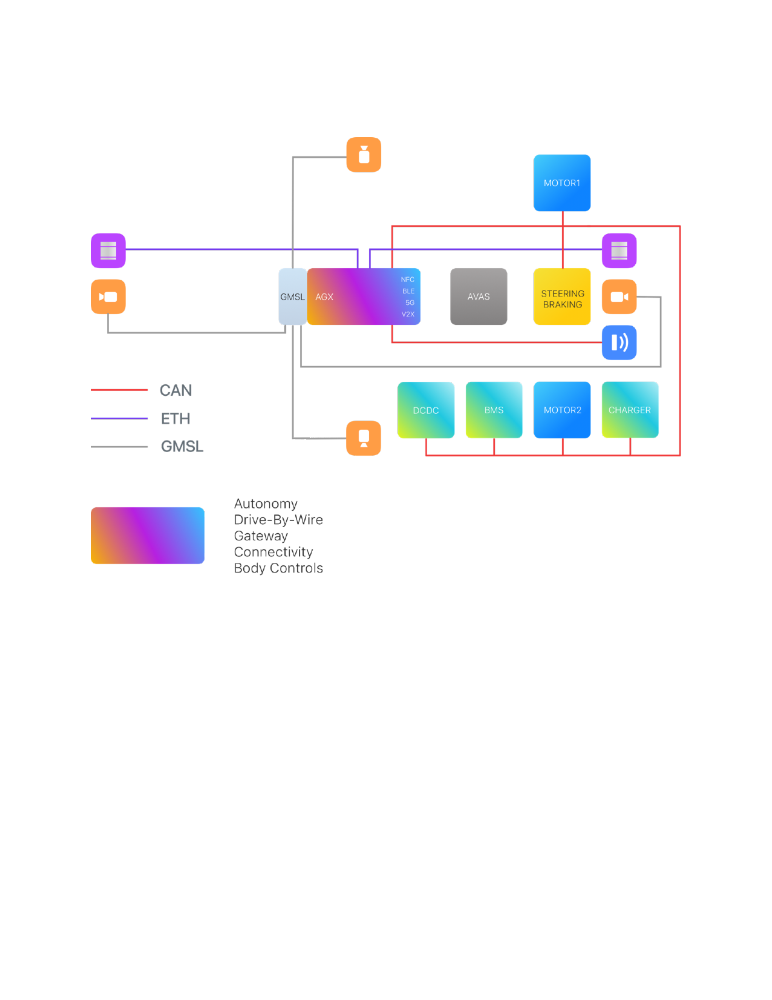

# Chassis Design

(To be completed)

## Vehicle Definition

[PDF](./ReferenceDrawingV2.pdf)

[Excel](AWFRefDesignWG_Chassis.xlsx)

|                  | Reference Design  |   |
| ---------------- | ----------------- |----- |
|                  | Wheel base (inch) | Dimension |
| Length           | 2500              | 3500 |
| Heigh            |                   | 2500 |
| Width            |                   | 1500 |
|                  |                   |  |
| Power Train      |                   |  |
| Battery Capacity |                   |  |
| Range            |                   |  |
| Voltage          |                   |  |
|                  |                   |  |
|                  |                   |  |
| Steering         |                   |  |
| 2 Wheel          | v                 |  |
| 4 Wheel          | Optional          |  |
| Power            |                   |  |
| 2 Wheel (2WD)    | V                 |  |
| 4 Wheel (4WD)    |                   |  |
| 6 Wheel (6WD)    |                   |  |
|                  |                   |  |
| Speed            | <20 kph           | 5, 10, 15 |
|                  |                   |  |
| Payload          |                   | 500 - 1000KG |
|                  |                   |  |
| Turn Radius      | \> 4M             |  |
| Slope            | 20 (degree)       |  |
|                  |                   |  |
|                  |                   |  |
|                  |                   |  |

## Example Drawing

[PDF](ReferenceDrawingV2.pdf)
