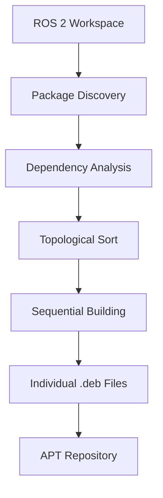

# Autoware Debian Package Deployment

This guide covers AutoSDV's Debian package deployment strategy, designed to simplify Autoware installation and distribution for production environments.

## Deployment Strategy

AutoSDV transforms the complex process of building and deploying Autoware into a simple, familiar Linux package management workflow. By packaging Autoware into Debian (`.deb`) files, we eliminate the need for end-users to manage `colcon` builds, ROS 2 workspaces, or complex dependency resolution.

**Key Components:**
- **Local APT Repository**: Contains all Autoware packages and dependencies
- **Configuration Package**: `autoware-localrepo` integrates the repository with the system
- **Standard Installation**: Uses familiar `apt` commands for installation and updates

## Installation Process

The end-user installation process is designed for simplicity and reliability:

### Step 1: Repository Configuration

Download and install the repository configuration package:

```bash
# Download from the release page
wget https://github.com/NEWSLabNTU/autoware/releases/download/rosdebian%2F2025.02-1/autoware-localrepo_2025.2-1_amd64.deb

# Install repository configuration
sudo dpkg -i autoware-localrepo_2025.2-1_amd64.deb
```

**Note**: Package filename varies by release version and target architecture.

### Step 2: Autoware Installation

With the repository configured, install Autoware using standard APT commands:

```bash
# Update package index
sudo apt update

# Install complete Autoware stack
sudo apt install autoware-full

# Or install specific components
sudo apt install autoware-planning autoware-perception
```

### Step 3: Verification

Verify the installation:

```bash
# Check installed packages
apt list --installed | grep autoware

# Verify ROS 2 environment
source /opt/ros/humble/setup.bash
ros2 pkg list | grep autoware
```

## Package Build System

The Debian package creation process is automated through a sophisticated build system that converts ROS 2 workspaces into distributable packages.

### Build Architecture

#### Core Build Scripts

**`scripts/make-deb.sh`** - Individual Package Builder
- Converts single ROS 2 packages into Debian packages
- Uses `bloom-generate` for Debian build file creation
- Employs `fakeroot` for secure package building
- Handles package metadata and dependency resolution

**`scripts/package-deb.sh`** - Build Orchestrator
- Discovers all ROS 2 packages in the workspace
- Performs topological sorting based on dependencies
- Manages build order to ensure proper dependency resolution
- Iterates through packages, invoking `make-deb.sh` for each

#### Build Process Flow



### Repository Management

#### Local APT Repository Structure

The build system creates a fully compliant APT repository:

```
autoware-apt-repo/
├── dists/
│   └── stable/
│       ├── main/
│       │   └── binary-amd64/
│       │       ├── Packages
│       │       └── Release
│       └── Release
└── pool/
    └── main/
        └── [package-name]/
            └── [package-name]_[version]_[arch].deb
```

#### Repository Integration

The `autoware-localrepo` package provides:
- APT source list configuration (`.list` file)
- GPG key management for package verification
- Automatic repository registration
- Priority and pinning configuration

### Distribution Strategy

**Development Builds**
- Continuous integration builds for testing
- Nightly packages for early adopters
- Branch-specific repositories for feature development

**Stable Releases**
- Versioned releases with semantic versioning
- Long-term support (LTS) package variants
- Security updates and critical fixes

**Enterprise Distribution**
- Private repository hosting options
- Custom package signing and verification
- Offline installation support

### Benefits for Developers

- **Simplified Distribution**: No need to manage complex build instructions
- **Version Control**: Precise tracking of deployed software versions
- **Dependency Management**: Automatic resolution of package dependencies
- **Rollback Capability**: Easy reversion to previous versions
- **Production Ready**: Battle-tested Linux package management system

This packaging strategy forms the foundation of AutoSDV's deployment philosophy, enabling reliable, scalable distribution of Autoware across diverse production environments.