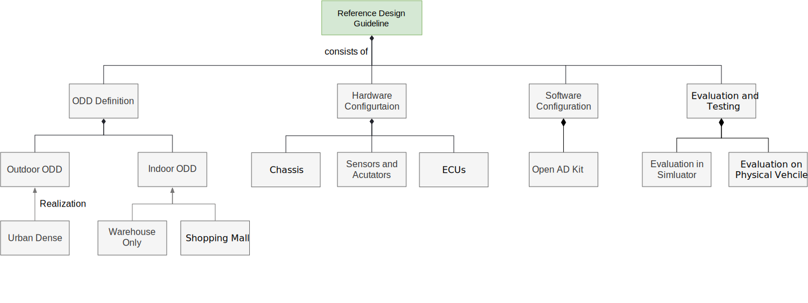

# Reference Design Guideline for LSA Vehicles

!!! warning

    The latest version is 0.1, but it has not been officially released yet.

## About Reference Design Guideline for LSA Vehicles

This document serves a guideline to design and deploy a TRL-6 low speed autonomy vehicle based on Autoware. The readers can take this document as a starting point to select and configure the hardware and software components of the vehicles.

For more details about the reference design WG, its goals and details of the Autoware Foundation working groups that oversees the project, refer to the [Reference Design WG wiki](https://github.com/autowarefoundation/RefDesignWG/wiki/)

## Reference Design Guideline for LSA Vehicles documentation structure

## Getting started

- [ODD](./odd-definition/index.md)
- [Hardware Configuration](./hardware-configuration/index.md)
- [Software Configuration](./software-configuration/index.md)
- [Evaluation and Testing](./evaluation-and-testing/index.md)

## Other Example Design

- [RoboRacer (F1Tenth)](./OtherExampleDesigns/F1Tenth/Reference%20Design%20for%20F1Tenth%20with%20Autoware.md) describes the design and implementation of racing robots using Autoware.

- [GoKart](./OtherExampleDesigns/GoKart/Reference%20Design%20for%20Go-Kart%20with%20Autoware.md) describes the design and implementation of EV GoKart using Autoware.

- [KWT LSV](./OtherExampleDesigns/LSV/Kingway_LSV_introduction_ENG_0729AWF_v1.pdf) describes the design and implementation of the LSV by KWT.

- [Start guide](./start-guide/index.md) describes how to install, set up and run Autoware and its associated simulators on supported development platforms.

- [System configuration](./system-configuration/index.md) describes the components that make up LSA vehicles in terms of the required hardware and software.
